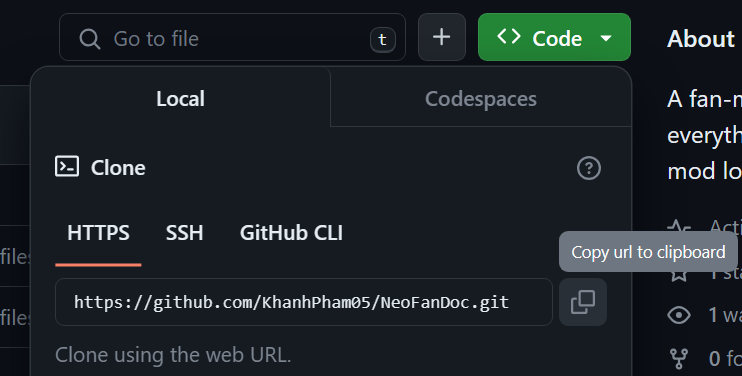

# Set up mod files
With IDE and JDK has ready set up. It's time to start constructing your (first) mod !

## Where to see the game files
In order to start mod Minecraft, you need, obviously, the Minecraft game files and the NeoForge mod-loader !

NeoForge's official website provides a link to their MDK template where you can download it and start your journey.

!!! note
    Here is where you can see the MDK : [https://github.com/neoforged/MDK](https://github.com/neoforged/MDK)

## How to download it
!!! note 
    If you want to host your own mod using this MDK, you can click on `Use this template` button and press `Create a new reposistory`. As a result, the system will make a copy of the MDK and put it in your newly created repository through that step.

In order to collect the files to your local computer. There are a couple of ways you can do it.

### Download directly
You can directly download the template as a zip file by **click on `Code <>`** button then **`Download ZIP`**.

### Download via Git
This step is a bit complicated as you need to install another software for GitHub called Git, [download here](https://git-scm.com/downloads). After that follow these steps :

- Press on the **`Code <>`** button on the GitHub repository, so you can see your full GitHub repository link for cloning. 

!!! note
    If you have repository created using the NeoForge's MDK template, you should just do that on your repository, otherwise doing that step directly from the template repository is okay. However, downloading the ZIP directly from the template repository is a better choice.
- Create a folder in your PC that you want to store your code in
???+ note
    It is recommended to avoid storing them in the `C:\` disk as it may take quite a decent amount of your storage, and you may not want to put them in `C:\` disk at all.
- Right-click on the newly created folder and click `Properties`, and copy the path in the `Location :` section, as we need to get the folder's location.
- Open Command Prompt (or Terminal or Powershell, either of them should work).
- Run this line and replace the `copied-path` with the path of the folder that you just previously copied.

``` commandline
cd copied-path
```

### Download directly from IDE
IntelliJ's project select screen has an option to download the files just like the mentioned GitHub section, but the IDE doesn't require any extra software.

* Get/Copy the link from the GitHub repository, see the first step of the [previous section](#download-via-git).
* Open IntelliJ IDEA and click on Get from VCS.
* Make sure the `Version Control` section is set to "Git".
* Copy the GitHub link to the URL field.
* Click clone.