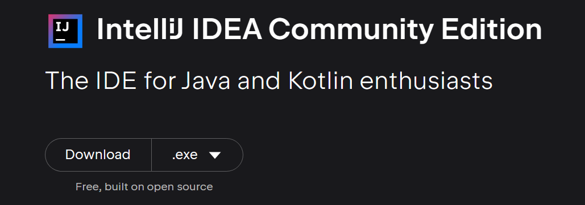

# Set up an IDE

It is highly recommended to use IntelliJ IDEA **Community Edition** which is a free Java IDEA that most Java developers choose.

## Installing IntelliJ

For convenience, this [link](https://www.jetbrains.com/idea/download) will direct you to the official IntelliJ IDEA downloading page.

1. Select an OS option that your PC is running. 
2. Scroll down to see the download option for Community Edition and **click Download**. 